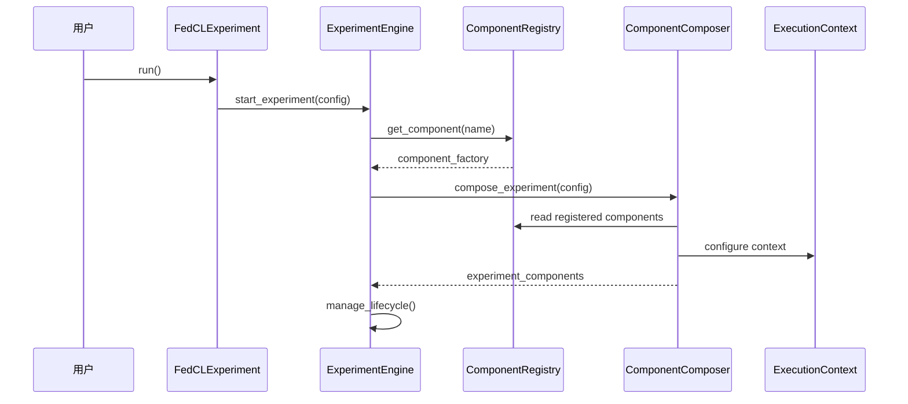
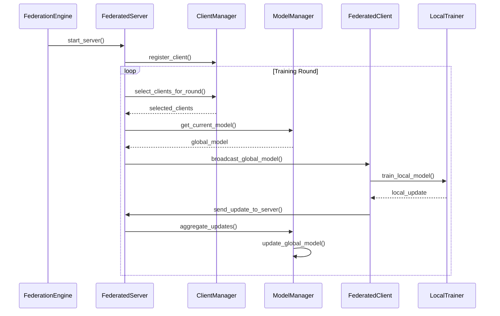
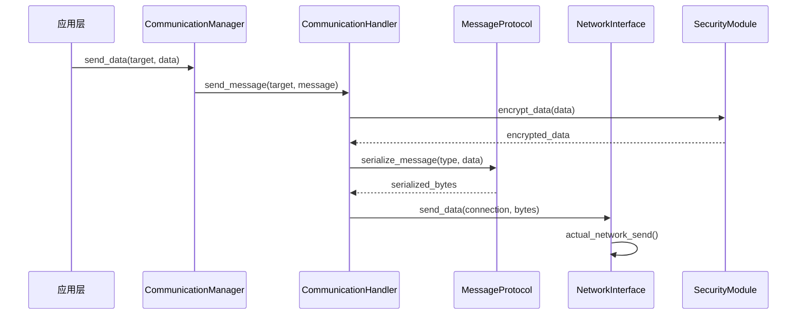
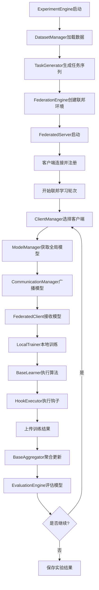
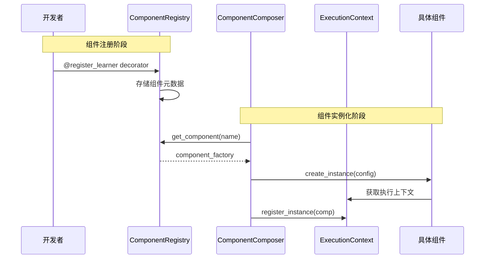
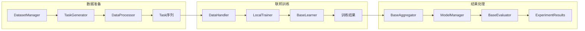
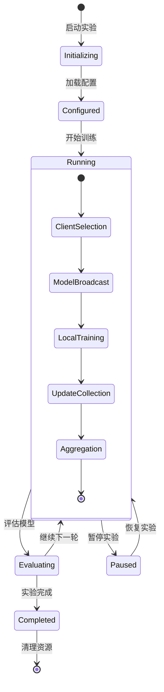

# FedCL组件交互逻辑详解

## 总体交互流程

### 1. 实验启动流程

```
用户调用 → QuickAPI/FedCLExperiment → ExperimentEngine → 各子引擎
```

**详细流程：**
1. **用户接口层启动**
   - `QuickAPI.quick_experiment()` 或 `FedCLExperiment.run()` 被调用
   - 加载并验证配置文件（通过 `ConfigManager`）
   - 创建工作目录和日志系统

2. **实验引擎初始化**
   - `ExperimentEngine.start_experiment()` 接管控制
   - 通过 `ComponentRegistry` 查找和加载所需组件
   - `ComponentComposer` 根据配置组装实验组件

3. **执行上下文创建**
   - `ExecutionContext` 被初始化，包含全局状态
   - 注册通信管理器和辅助模型
   - 设置度量收集和日志记录

## 2. 模块内交互逻辑

### 核心框架层内部交互



**关键交互点：**
- **组件发现**: `ComponentRegistry` 维护所有可用组件的映射
- **依赖注入**: `ComponentComposer` 解析配置并创建组件实例
- **状态管理**: `ExecutionContext` 作为所有组件的共享状态容器

### 联邦学习核心交互



**交互特点：**
- **异步通信**: 客户端和服务端通过异步消息传递
- **状态同步**: 全局模型状态在服务端维护，定期广播给客户端
- **负载均衡**: `ClientManager` 负责客户端选择和负载分配

### 通信系统交互



**安全流程：**
- 所有数据在传输前都经过加密
- 消息格式统一通过 `MessageProtocol` 管理
- 连接状态由 `NetworkInterface` 维护

## 3. 跨模块交互逻辑

### 训练流程完整交互



### 组件注册与发现流程



### 数据流转逻辑



## 4. 关键交互模式

### 事件驱动交互

**Hook执行机制：**
```python
# 训练过程中的Hook触发
class TrainingEngine:
    def train_task(self, task_id, data):
        # 训练前Hook
        self.hook_executor.execute_hooks('before_task', self.context, 
                                        task_id=task_id, data=data)
        
        # 执行训练
        results = self.learner.train_task(data)
        
        # 训练后Hook
        self.hook_executor.execute_hooks('after_task', self.context,
                                        task_id=task_id, results=results)
        return results
```

### 状态共享机制

**ExecutionContext作为中央状态管理：**
```python
class ExecutionContext:
    def share_state_across_components(self):
        # 全局状态: 所有组件可访问
        self.global_state = {
            'current_round': 0,
            'global_model': None,
            'client_updates': []
        }
        
        # 局部状态: 特定组件私有
        self.local_state = {
            'client_001': {'local_model': model, 'data': data},
            'client_002': {'local_model': model, 'data': data}
        }
```

### 异步通信模式

**客户端-服务端异步交互：**
```python
# 服务端异步处理
async def server_round_coordination(self):
    # 并行广播模型给所有选中的客户端
    await asyncio.gather(*[
        self.send_model_to_client(client_id) 
        for client_id in selected_clients
    ])
    
    # 并行收集客户端更新
    updates = await asyncio.gather(*[
        self.collect_update_from_client(client_id)
        for client_id in selected_clients
    ])
    
    # 聚合更新
    global_update = self.aggregator.aggregate(updates)
```

## 5. 生命周期管理

### 实验生命周期



### 组件生命周期

```python
class ComponentLifecycleManager:
    def manage_component_lifecycle(self, component):
        try:
            # 1. 初始化阶段
            component.initialize(self.context)
            
            # 2. 配置阶段
            component.configure(self.config)
            
            # 3. 运行阶段
            component.start()
            
            # 4. 监控阶段
            while component.is_running():
                self.monitor_component(component)
                
        except Exception as e:
            # 5. 错误处理
            component.handle_error(e)
            
        finally:
            # 6. 清理阶段
            component.cleanup()
```

## 6. 错误处理与恢复

### 分布式错误处理

```python
class DistributedErrorHandler:
    def handle_client_failure(self, failed_client_id):
        # 1. 检测客户端失败
        self.client_manager.mark_client_as_failed(failed_client_id)
        
        # 2. 重新选择客户端
        replacement_clients = self.client_manager.select_replacement_clients(1)
        
        # 3. 调整聚合策略
        self.aggregator.adjust_for_missing_clients([failed_client_id])
        
        # 4. 继续训练
        return replacement_clients
        
    def handle_network_partition(self):
        # 1. 检测网络分区
        active_clients = self.communication_manager.get_active_clients()
        
        # 2. 如果活跃客户端数量足够，继续训练
        if len(active_clients) >= self.min_clients_threshold:
            return self.continue_with_subset(active_clients)
        else:
            return self.pause_and_wait_for_reconnection()
```

## 7. 性能优化交互

### 内存管理

```python
class MemoryOptimizedInteraction:
    def optimize_model_sharing(self):
        # 使用模型差分而不是完整模型传输
        model_diff = self.model_manager.compute_model_diff(
            old_model=self.previous_global_model,
            new_model=self.current_global_model
        )
        
        # 压缩传输数据
        compressed_diff = self.communication_manager.compress_data(model_diff)
        
        return compressed_diff
        
    def lazy_data_loading(self):
        # 延迟加载大数据集
        return self.dataset_manager.create_lazy_loader(
            dataset_path=self.data_path,
            batch_size=self.batch_size
        )
```

### 并行化策略

```python
class ParallelExecutionManager:
    def parallel_client_training(self):
        # 客户端并行训练
        with ThreadPoolExecutor(max_workers=self.max_concurrent_clients) as executor:
            futures = [
                executor.submit(client.train_local_model, task_data)
                for client in self.selected_clients
            ]
            
            # 收集结果
            results = [future.result() for future in futures]
        
        return results
```

这个交互逻辑说明了整个FedCL系统中各组件如何协同工作，从高层的实验管理到底层的网络通信，每个组件都有明确的职责和交互接口。理解这些交互逻辑有助于系统的开发、调试和扩展。