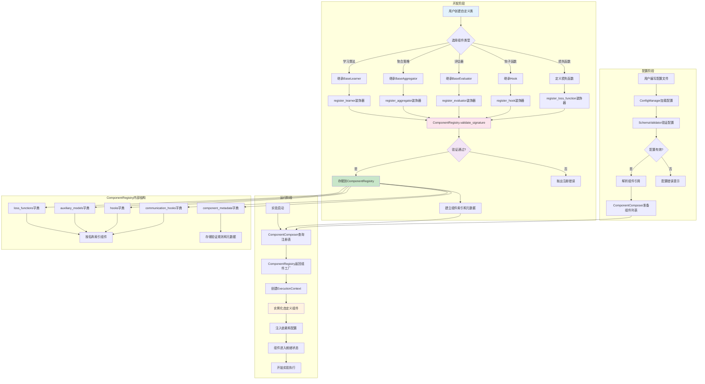

```mermaid
graph TD
    subgraph "开发阶段"
        A[用户创建自定义类] --> B{选择组件类型}
        B -->|学习算法| C[继承BaseLearner]
        B -->|聚合策略| D[继承BaseAggregator]
        B -->|评估器| E[继承BaseEvaluator]
        B -->|钩子函数| F[继承Hook]
        B -->|损失函数| G[定义损失函数]
        
        C --> H[register_learner装饰器]
        D --> I[register_aggregator装饰器]
        E --> J[register_evaluator装饰器]
        F --> K[register_hook装饰器]
        G --> L[register_loss_function装饰器]
        
        H --> M[ComponentRegistry.validate_signature]
        I --> M
        J --> M
        K --> M
        L --> M
        
        M --> N{验证通过?}
        N -->|是| O[存储到ComponentRegistry]
        N -->|否| P[抛出注册错误]
        
        O --> Q[建立组件索引和元数据]
    end
    
    subgraph "配置阶段"
        R[用户编写配置文件] --> S[ConfigManager加载配置]
        S --> T[SchemaValidator验证配置]
        T --> U{配置有效?}
        U -->|是| V[解析组件引用]
        U -->|否| W[配置错误提示]
        
        V --> X[ComponentComposer准备组件列表]
    end
    
    subgraph "运行阶段"
        Y[实验启动] --> Z[ComponentComposer查询注册表]
        Z --> AA[ComponentRegistry返回组件工厂]
        AA --> BB[创建ExecutionContext]
        BB --> CC[实例化自定义组件]
        CC --> DD[注入依赖和配置]
        DD --> EE[组件进入就绪状态]
        EE --> FF[开始实验执行]
    end
    
    subgraph "ComponentRegistry内部结构"
        O --> GG[loss_functions字典]
        O --> HH[auxiliary_models字典]
        O --> II[hooks字典]
        O --> JJ[communication_hooks字典]
        O --> KK[component_metadata字典]
        
        GG --> LL[按名称索引组件]
        HH --> LL
        II --> LL
        JJ --> LL
        KK --> MM[存储验证规则和元数据]
    end
    
    Q --> Z
    X --> Z
    
    style A fill:#e3f2fd
    style O fill:#c8e6c9
    style CC fill:#fff3e0
    style M fill:#fce4ec
    style N fill:#f3e5f5
```