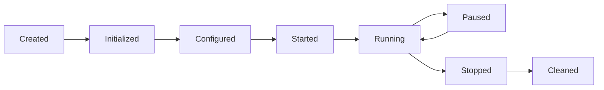
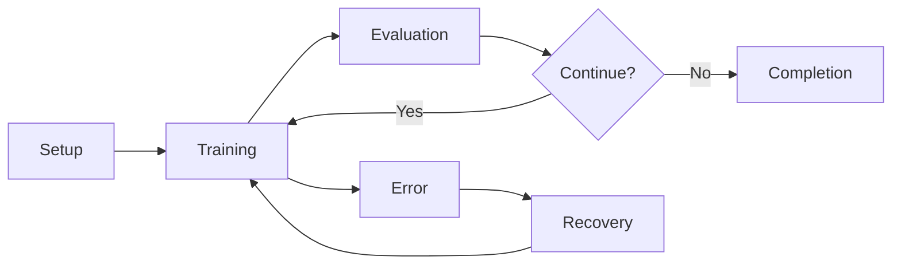

# 组件交互关键要点总结

## 🎯 核心交互模式

### 1. 分层交互模式
```
用户接口层 → 执行引擎层 → 核心抽象层 → 具体实现层 → 数据/通信层
```

**特点：**
- **单向依赖**: 上层依赖下层，下层不知道上层存在
- **接口隔离**: 通过抽象接口解耦具体实现
- **职责分离**: 每层有明确的职责边界

### 2. 事件驱动模式
```
组件A触发事件 → Hook系统 → 注册的监听器 → 执行回调 → 状态更新
```

**应用场景：**
- 训练生命周期管理 (`before_task`, `after_task`)
- 度量收集和日志记录
- 检查点保存
- 自定义扩展逻辑

### 3. 异步通信模式
```
发送方 → 消息队列/网络层 → 接收方
```

**关键组件：**
- `CommunicationManager`: 管理所有网络通信
- `MessageProtocol`: 统一消息格式
- `NetworkInterface`: 底层网络抽象

## 📊 数据流转路径

### 训练数据流
```
DatasetManager → TaskGenerator → DataProcessor → Task → 
LocalTrainer → BaseLearner → 训练结果 → BaseAggregator → 
ModelManager → 全局模型更新
```

### 配置数据流
```
ConfigManager → 配置验证 → ComponentComposer → 
组件实例化 → ExecutionContext → 运行时配置访问
```

### 状态数据流
```
局部状态更新 → ExecutionContext → 全局状态同步 → 
其他组件访问 → 状态一致性维护
```

## ⚡ 关键交互时机

### 1. 系统启动时
1. **配置加载**: `ConfigManager` 加载和验证配置
2. **组件注册**: `ComponentRegistry` 发现可用组件
3. **依赖注入**: `ComponentComposer` 创建组件实例
4. **上下文初始化**: `ExecutionContext` 建立共享状态
5. **生命周期启动**: 各组件进入就绪状态

### 2. 联邦学习轮次中
1. **客户端选择**: `ClientManager` 选择参与客户端
2. **模型广播**: `CommunicationManager` 分发全局模型
3. **并行训练**: 多个 `FederatedClient` 同时本地训练
4. **更新收集**: 服务端收集客户端更新
5. **模型聚合**: `BaseAggregator` 合并客户端更新
6. **模型评估**: `EvaluationEngine` 评估新模型

### 3. 错误发生时
1. **错误检测**: 监控组件发现异常
2. **错误分类**: `ErrorHandler` 判断错误类型
3. **恢复策略**: 选择适当的恢复方案
4. **状态恢复**: 从检查点恢复或重新初始化
5. **继续执行**: 系统恢复正常运行

## 🔄 生命周期管理

### 组件生命周期


### 实验生命周期


## 🛡️ 容错与恢复机制

### 1. 客户端故障处理
```python
# 故障检测 → 客户端替换 → 聚合调整 → 继续训练
def handle_client_failure(failed_client):
    replacement = select_replacement_client()
    adjust_aggregation_weights(failed_client)
    continue_training_with_replacement(replacement)
```

### 2. 网络分区处理
```python
# 分区检测 → 评估影响 → 选择策略 → 执行恢复
def handle_network_partition():
    active_clients = detect_active_clients()
    if len(active_clients) >= min_threshold:
        continue_with_subset(active_clients)
    else:
        pause_and_wait_for_healing()
```

### 3. 服务端故障恢复
```python
# 检查点恢复 → 状态重建 → 连接重建 → 继续服务
def recover_server():
    latest_checkpoint = load_latest_checkpoint()
    rebuild_server_state(latest_checkpoint)
    reconnect_all_clients()
```

## 🔧 性能优化交互

### 1. 内存优化
- **延迟加载**: 数据集按需加载，减少内存占用
- **模型压缩**: 传输模型差分而非完整模型
- **垃圾回收**: 及时清理不需要的中间结果

### 2. 并行化优化
- **客户端并行**: 多个客户端同时训练
- **模型广播并行**: 同时向多个客户端发送模型
- **聚合并行**: 并行处理客户端更新

### 3. 网络优化
- **数据压缩**: 传输前压缩模型和梯度
- **批量操作**: 合并多个小消息为大消息
- **连接池**: 复用网络连接减少开销

## 📈 扩展性设计

### 1. 新算法接入
```python
@register_learner("NewAlgorithm")
class NewLearner(BaseLearner):
    def train_task(self, task_data):
        # 新算法实现
        pass
```

### 2. 自定义Hook
```python
@register_hook("custom_phase", priority=1)
class CustomHook(Hook):
    def execute(self, context, **kwargs):
        # 自定义逻辑
        pass
```

### 3. 通信协议扩展
```python
class CustomProtocol(MessageProtocol):
    def serialize_custom_message(self, data):
        # 自定义消息格式
        pass
```

## 🎨 交互设计原则

### 1. **松耦合**: 组件间通过接口交互，降低依赖性
### 2. **高内聚**: 相关功能集中在同一组件内
### 3. **可扩展**: 支持插件式扩展和算法替换
### 4. **可测试**: 每个组件可独立测试
### 5. **可监控**: 关键交互点都有监控和日志
### 6. **容错性**: 单点故障不影响整体系统
### 7. **一致性**: 分布式状态保持最终一致性

这些交互设计确保了 FedCL 系统的**可维护性**、**可扩展性**和**可靠性**，使其能够适应不同的联邦学习场景和算法需求。