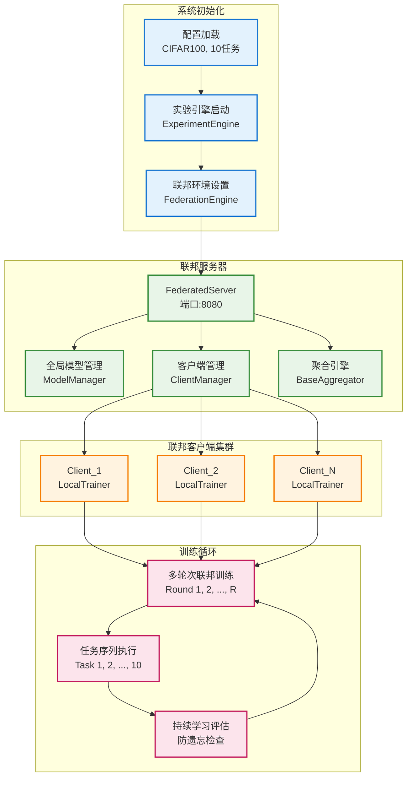

```mermaid
flowchart TD
    %% 系统初始化
    subgraph "系统初始化"
        A1[配置加载<br/>CIFAR100, 10任务]
        A2[实验引擎启动<br/>ExperimentEngine]
        A3[联邦环境设置<br/>FederationEngine]
    end
    
    %% 核心组件
    subgraph "联邦服务器"
        B1[FederatedServer<br/>端口:8080]
        B2[全局模型管理<br/>ModelManager]
        B3[客户端管理<br/>ClientManager]
        B4[聚合引擎<br/>BaseAggregator]
    end
    
    subgraph "联邦客户端集群"
        C1[Client_1<br/>LocalTrainer]
        C2[Client_2<br/>LocalTrainer]
        C3[Client_N<br/>LocalTrainer]
    end
    
    %% 核心流程
    subgraph "训练循环"
        D1[多轮次联邦训练<br/>Round 1, 2, ..., R]
        D2[任务序列执行<br/>Task 1, 2, ..., 10]
        D3[持续学习评估<br/>防遗忘检查]
    end
    
    %% 连接关系
    A1 --> A2
    A2 --> A3
    A3 --> B1
    B1 --> B2
    B1 --> B3
    B1 --> B4
    
    B3 --> C1
    B3 --> C2
    B3 --> C3
    
    C1 --> D1
    C2 --> D1
    C3 --> D1
    
    D1 --> D2
    D2 --> D3
    D3 --> D1
    
    %% 样式
    classDef initStage fill:#e3f2fd,stroke:#1976d2,stroke-width:2px
    classDef serverStage fill:#e8f5e8,stroke:#388e3c,stroke-width:2px
    classDef clientStage fill:#fff3e0,stroke:#f57c00,stroke-width:2px
    classDef trainingStage fill:#fce4ec,stroke:#c2185b,stroke-width:2px
    
    class A1,A2,A3 initStage
    class B1,B2,B3,B4 serverStage
    class C1,C2,C3 clientStage
    class D1,D2,D3 trainingStage
```

