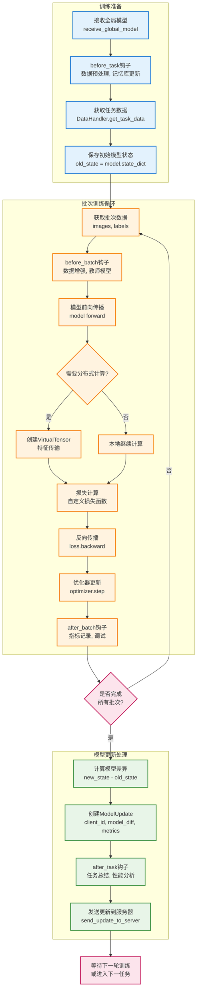

```mermaid
flowchart TD
    %% 训练准备
    subgraph "训练准备"
        A1[接收全局模型<br/>receive_global_model]
        A2[before_task钩子<br/>数据预处理, 记忆库更新]
        A3[获取任务数据<br/>DataHandler.get_task_data]
        A4[保存初始模型状态<br/>old_state = model.state_dict]
    end
    
    %% 批次训练循环
    subgraph "批次训练循环"
        B1[获取批次数据<br/>images, labels]
        B2[before_batch钩子<br/>数据增强, 教师模型]
        B3[模型前向传播<br/>model forward]
        B4{需要分布式计算?}
        B5[创建VirtualTensor<br/>特征传输]
        B6[本地继续计算]
        B7[损失计算<br/>自定义损失函数]
        B8[反向传播<br/>loss.backward]
        B9[优化器更新<br/>optimizer.step]
        B10[after_batch钩子<br/>指标记录, 调试]
    end
    
    %% 模型更新
    subgraph "模型更新处理"
        C1[计算模型差异<br/>new_state - old_state]
        C2[创建ModelUpdate<br/>client_id, model_diff, metrics]
        C3[after_task钩子<br/>任务总结, 性能分析]
        C4[发送更新到服务器<br/>send_update_to_server]
    end
    
    %% 循环控制
    D1{是否完成<br/>所有批次?}
    D2[等待下一轮训练<br/>或进入下一任务]
    
    %% 连接关系
    A1 --> A2
    A2 --> A3
    A3 --> A4
    A4 --> B1
    
    B1 --> B2
    B2 --> B3
    B3 --> B4
    B4 -->|是| B5
    B4 -->|否| B6
    B5 --> B7
    B6 --> B7
    B7 --> B8
    B8 --> B9
    B9 --> B10
    
    B10 --> D1
    D1 -->|否| B1
    D1 -->|是| C1
    
    C1 --> C2
    C2 --> C3
    C3 --> C4
    C4 --> D2
    
    %% 样式
    classDef preparation fill:#e3f2fd,stroke:#1976d2,stroke-width:2px
    classDef batchTrain fill:#fff3e0,stroke:#f57c00,stroke-width:2px
    classDef modelUpdate fill:#e8f5e8,stroke:#388e3c,stroke-width:2px
    classDef control fill:#fce4ec,stroke:#c2185b,stroke-width:2px
    
    class A1,A2,A3,A4 preparation
    class B1,B2,B3,B4,B5,B6,B7,B8,B9,B10 batchTrain
    class C1,C2,C3,C4 modelUpdate
    class D1,D2 control
```