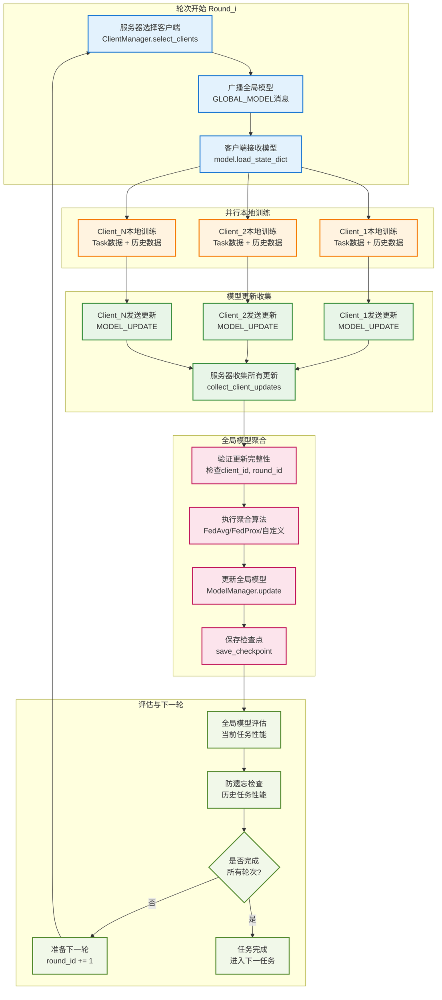

```mermaid
flowchart TD
    %% 轮次开始
    subgraph "轮次开始 Round_i"
        A1[服务器选择客户端<br/>ClientManager.select_clients]
        A2[广播全局模型<br/>GLOBAL_MODEL消息]
        A3[客户端接收模型<br/>model.load_state_dict]
    end
    
    %% 并行本地训练
    subgraph "并行本地训练"
        B1[Client_1本地训练<br/>Task数据 + 历史数据]
        B2[Client_2本地训练<br/>Task数据 + 历史数据]
        B3[Client_N本地训练<br/>Task数据 + 历史数据]
    end
    
    %% 模型更新收集
    subgraph "模型更新收集"
        C1[Client_1发送更新<br/>MODEL_UPDATE]
        C2[Client_2发送更新<br/>MODEL_UPDATE]
        C3[Client_N发送更新<br/>MODEL_UPDATE]
        C4[服务器收集所有更新<br/>collect_client_updates]
    end
    
    %% 模型聚合
    subgraph "全局模型聚合"
        D1[验证更新完整性<br/>检查client_id, round_id]
        D2[执行聚合算法<br/>FedAvg/FedProx/自定义]
        D3[更新全局模型<br/>ModelManager.update]
        D4[保存检查点<br/>save_checkpoint]
    end
    
    %% 评估与下一轮
    subgraph "评估与下一轮"
        E1[全局模型评估<br/>当前任务性能]
        E2[防遗忘检查<br/>历史任务性能]
        E3{是否完成<br/>所有轮次?}
        E4[准备下一轮<br/>round_id += 1]
        E5[任务完成<br/>进入下一任务]
    end
    
    %% 连接关系
    A1 --> A2
    A2 --> A3
    A3 --> B1
    A3 --> B2
    A3 --> B3
    
    B1 --> C1
    B2 --> C2
    B3 --> C3
    
    C1 --> C4
    C2 --> C4
    C3 --> C4
    
    C4 --> D1
    D1 --> D2
    D2 --> D3
    D3 --> D4
    
    D4 --> E1
    E1 --> E2
    E2 --> E3
    E3 -->|否| E4
    E3 -->|是| E5
    E4 --> A1
    
    %% 样式
    classDef roundStart fill:#e3f2fd,stroke:#1976d2,stroke-width:2px
    classDef localTrain fill:#fff3e0,stroke:#f57c00,stroke-width:2px
    classDef updateCollect fill:#e8f5e8,stroke:#388e3c,stroke-width:2px
    classDef aggregation fill:#fce4ec,stroke:#c2185b,stroke-width:2px
    classDef evaluation fill:#f1f8e9,stroke:#558b2f,stroke-width:2px
    
    class A1,A2,A3 roundStart
    class B1,B2,B3 localTrain
    class C1,C2,C3,C4 updateCollect
    class D1,D2,D3,D4 aggregation
    class E1,E2,E3,E4,E5 evaluation
```