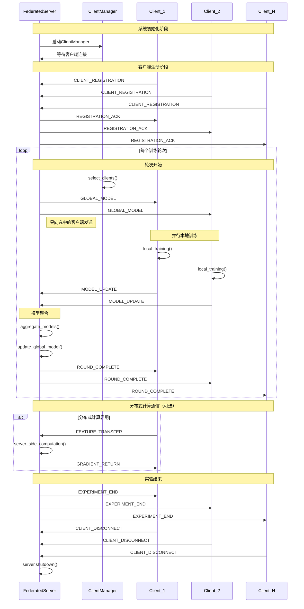

```mermaid
sequenceDiagram
    participant S as FederatedServer
    participant CM as ClientManager
    participant C1 as Client_1
    participant C2 as Client_2
    participant CN as Client_N
    
    %% 初始化阶段
    Note over S,CN: 系统初始化阶段
    S->>CM: 启动ClientManager
    CM->>S: 等待客户端连接
    
    %% 客户端注册
    Note over S,CN: 客户端注册阶段
    C1->>S: CLIENT_REGISTRATION
    C2->>S: CLIENT_REGISTRATION
    CN->>S: CLIENT_REGISTRATION
    
    S->>C1: REGISTRATION_ACK
    S->>C2: REGISTRATION_ACK
    S->>CN: REGISTRATION_ACK
    
    %% 联邦训练轮次
    loop 每个训练轮次
        Note over S,CN: 轮次开始
        CM->>CM: select_clients()
        
        %% 模型广播
        S->>C1: GLOBAL_MODEL
        S->>C2: GLOBAL_MODEL
        Note right of S: 只向选中的客户端发送
        
        %% 本地训练
        Note over C1,C2: 并行本地训练
        C1->>C1: local_training()
        C2->>C2: local_training()
        
        %% 模型更新上传
        C1->>S: MODEL_UPDATE
        C2->>S: MODEL_UPDATE
        
        %% 服务器聚合
        Note over S: 模型聚合
        S->>S: aggregate_models()
        S->>S: update_global_model()
        
        %% 轮次完成通知
        S->>C1: ROUND_COMPLETE
        S->>C2: ROUND_COMPLETE
        S->>CN: ROUND_COMPLETE
    end
    
    %% 可选：分布式计算通信
    Note over S,CN: 分布式计算通信（可选）
    alt 分布式计算启用
        C1->>S: FEATURE_TRANSFER
        S->>S: server_side_computation()
        S->>C1: GRADIENT_RETURN
    end
    
    %% 实验结束
    Note over S,CN: 实验结束
    S->>C1: EXPERIMENT_END
    S->>C2: EXPERIMENT_END
    S->>CN: EXPERIMENT_END
    
    C1->>S: CLIENT_DISCONNECT
    C2->>S: CLIENT_DISCONNECT
    CN->>S: CLIENT_DISCONNECT
    
    S->>S: server.shutdown()
```