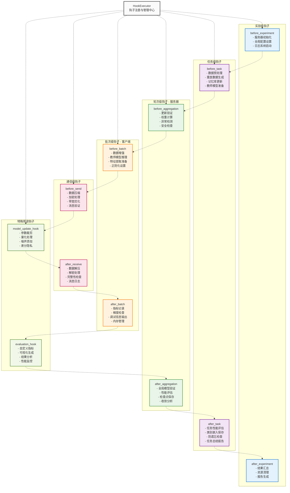

```mermaid
flowchart TD
    %% 实验级钩子
    subgraph "实验级钩子"
        A1[before_experiment<br/>- 服务器初始化<br/>- 全局配置设置<br/>- 日志系统启动]
        A2[after_experiment<br/>- 结果汇总<br/>- 资源清理<br/>- 报告生成]
    end
    
    %% 任务级钩子
    subgraph "任务级钩子"
        B1[before_task<br/>- 数据预处理<br/>- 重放数据生成<br/>- 记忆库更新<br/>- 教师模型准备]
        B2[after_task<br/>- 任务性能评估<br/>- 类别嵌入保存<br/>- 防遗忘检查<br/>- 任务总结报告]
    end
    
    %% 轮次级钩子（服务器端）
    subgraph "轮次级钩子 - 服务器"
        C1[before_aggregation<br/>- 更新验证<br/>- 权重计算<br/>- 异常检测<br/>- 安全检查]
        C2[after_aggregation<br/>- 全局模型验证<br/>- 性能评估<br/>- 检查点保存<br/>- 收敛分析]
    end
    
    %% 批次级钩子（客户端）
    subgraph "批次级钩子 - 客户端"
        D1[before_batch<br/>- 数据增强<br/>- 教师模型推理<br/>- 特征提取准备<br/>- 正则化设置]
        D2[after_batch<br/>- 指标记录<br/>- 梯度检查<br/>- 调试信息输出<br/>- 内存管理]
    end
    
    %% 通信级钩子
    subgraph "通信级钩子"
        E1[before_send<br/>- 数据压缩<br/>- 加密处理<br/>- 带宽优化<br/>- 消息验证]
        E2[after_receive<br/>- 数据解压<br/>- 解密处理<br/>- 完整性检查<br/>- 消息日志]
    end
    
    %% 特殊用途钩子
    subgraph "特殊用途钩子"
        F1[model_update_hook<br/>- 参数裁剪<br/>- 量化处理<br/>- 噪声添加<br/>- 差分隐私]
        F2[evaluation_hook<br/>- 自定义指标<br/>- 可视化生成<br/>- 结果分析<br/>- 性能监控]
    end
    
    %% 执行时机连接
    A1 -.-> B1
    B1 -.-> C1
    C1 -.-> D1
    D1 -.-> E1
    E1 -.-> F1
    
    F1 -.-> E2
    E2 -.-> D2
    D2 -.-> F2
    F2 -.-> C2
    C2 -.-> B2
    B2 -.-> A2
    
    %% 钩子注册中心
    G1[HookExecutor<br/>钩子注册与管理中心]
    G1 -.-> A1
    G1 -.-> B1
    G1 -.-> C1
    G1 -.-> D1
    G1 -.-> E1
    G1 -.-> F1
    
    %% 样式
    classDef experimentHook fill:#e3f2fd,stroke:#1976d2,stroke-width:2px
    classDef taskHook fill:#f3e5f5,stroke:#7b1fa2,stroke-width:2px
    classDef roundHook fill:#e8f5e8,stroke:#388e3c,stroke-width:2px
    classDef batchHook fill:#fff3e0,stroke:#f57c00,stroke-width:2px
    classDef commHook fill:#fce4ec,stroke:#c2185b,stroke-width:2px
    classDef specialHook fill:#f1f8e9,stroke:#558b2f,stroke-width:2px
    classDef executorStyle fill:#fafafa,stroke:#616161,stroke-width:3px
    
    class A1,A2 experimentHook
    class B1,B2 taskHook
    class C1,C2 roundHook
    class D1,D2 batchHook
    class E1,E2 commHook
    class F1,F2 specialHook
    class G1 executorStyle
```