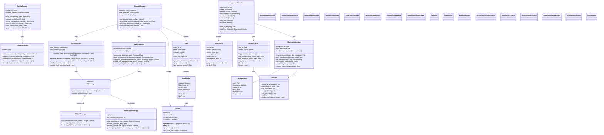

```mermaid
classDiagram
    %% 配置管理
    class ConfigManager {
        -config: DictConfig
        -schema_validator: SchemaValidator
        +load_config(config_path) DictConfig
        +validate_config(config) bool
        +merge_configs(base, override) DictConfig
        +resolve_references(config) DictConfig
        +save_config(config, path) void
        +get_nested_value(path, default) Any
    }
    
    class SchemaValidator {
        -schema: Dict
        +validate_experiment_config(config) ValidationResult
        +validate_model_config(config) ValidationResult
        +validate_data_config(config) ValidationResult
        +check_required_fields(config, schema) List[str]
        +check_field_types(config, schema) List[str]
    }
    
    %% 数据集管理
    class DatasetManager {
        -datasets: Dict[str, Dataset]
        -task_generator: TaskGenerator
        -data_cache: Dict[str, Any]
        +load_dataset(name, config) Dataset
        +create_task_sequence(dataset, num_tasks) List[Task]
        +get_client_data(client_id, task_id) DataLoader
        +cache_dataset(name, dataset) void
        +clear_cache() void
    }
    
    class TaskGenerator {
        -split_strategy: SplitStrategy
        -class_ordering: List[int]
        +generate_class_incremental_tasks(dataset, classes_per_task) List[Task]
        +generate_domain_incremental_tasks(dataset, domains) List[Task]
        +generate_task_incremental_tasks(dataset, task_configs) List[Task]
        +shuffle_classes(seed) List[int]
        +validate_task_sequence(tasks) bool
    }
    
    %% 数据处理
    class DataProcessor {
        -transforms: List[Transform]
        -augmentations: List[Augmentation]
        +preprocess_data(raw_data) ProcessedData
        +apply_transforms(data, transform_config) TransformedData
        +split_data_federated(dataset, num_clients, strategy) Dict[str, Dataset]
        +create_non_iid_split(dataset, alpha) Dict[str, Dataset]
        +balance_client_data(client_datasets) Dict[str, Dataset]
    }
    
    class SplitStrategy {
        <<abstract>>
        +split_data(dataset, num_clients) Dict[str, Dataset]*
        +validate_split(split_data) bool*
    }
    
    class IIDSplitStrategy {
        +split_data(dataset, num_clients) Dict[str, Dataset]
        +validate_split(split_data) bool
        +random_split(dataset, ratios) List[Dataset]
    }
    
    class NonIIDSplitStrategy {
        -alpha: float
        -min_samples_per_client: int
        +split_data(dataset, num_clients) Dict[str, Dataset]
        +validate_split(split_data) bool
        +dirichlet_split(dataset, alpha) Dict[str, Dataset]
        +pathological_split(dataset, shards_per_client) Dict[str, Dataset]
    }
    
    %% 核心数据结构
    class Task {
        +task_id: int
        +data: DataLoader
        +classes: List[int]
        +metadata: Dict
        +task_type: TaskType
        +get_class_distribution() Dict[int, int]
        +get_sample_count() int
        +get_memory_usage() float
    }
    
    class Dataset {
        +name: str
        +data: torch.Tensor
        +targets: torch.Tensor
        +transform: Transform
        +__getitem__(index) Tuple[torch.Tensor, int]
        +__len__() int
        +get_classes() List[int]
        +get_class_distribution() Dict[int, int]
    }
    
    class DataLoader {
        +dataset: Dataset
        +batch_size: int
        +shuffle: bool
        +num_workers: int
        +__iter__() Iterator
        +__len__() int
    }
    
    %% 实验结果与输出
    class ExperimentResults {
        +experiment_id: str
        +config: DictConfig
        +metrics: Dict[str, List[float]]
        +task_results: List[TaskResults]
        +checkpoints: List[Path]
        +artifacts: Dict[str, Any]
        +start_time: datetime
        +end_time: datetime
        +save_to_file(path) void
        +load_from_file(path) ExperimentResults
        +generate_summary() Dict
    }
    
    class TaskResults {
        +task_id: int
        +metrics: Dict[str, float]
        +training_time: float
        +memory_usage: float
        +model_size: int
        +convergence_step: int
        +get_metric(name, default) float
        +to_dict() Dict
    }
    
    class MetricsLogger {
        -log_dir: Path
        -writers: Dict[str, Writer]
        +log_scalar(tag, value, step) void
        +log_histogram(tag, values, step) void
        +log_image(tag, image, step) void
        +log_hyperparameters(hparams) void
        +flush() void
        +close() void
    }
    
    %% 检查点管理
    class CheckpointManager {
        -checkpoint_dir: Path
        -max_checkpoints: int
        -checkpoint_history: List[CheckpointInfo]
        +save_checkpoint(state_dict, metadata) Path
        +load_checkpoint(checkpoint_path) Dict
        +list_checkpoints() List[CheckpointInfo]
        +cleanup_old_checkpoints() void
        +get_latest_checkpoint() Path
        +restore_from_checkpoint(path) bool
    }
    
    class CheckpointInfo {
        +path: Path
        +timestamp: datetime
        +round_id: int
        +task_id: int
        +metadata: Dict
        +file_size: int
    }
    
    %% 工具类
    class FileUtils {
        +ensure_dir_exists(path) void
        +save_json(data, path) void
        +load_json(path) Dict
        +save_pickle(obj, path) void
        +load_pickle(path) Any
        +get_file_size(path) int
        +compress_file(source, target) void
    }
    
    %% 关系定义
    ConfigManager --> SchemaValidator : uses
    
    DatasetManager --> TaskGenerator : uses
    DatasetManager --> DataProcessor : uses
    DatasetManager --> Dataset : creates
    DatasetManager --> Task : creates
    
    TaskGenerator --> SplitStrategy : uses
    DataProcessor --> SplitStrategy : uses
    
    SplitStrategy <|-- IIDSplitStrategy : implements
    SplitStrategy <|-- NonIIDSplitStrategy : implements
    
    Task --> DataLoader : contains
    DataLoader --> Dataset : uses
    
    ExperimentResults --> TaskResults : contains
    ExperimentResults --> MetricsLogger : uses
    ExperimentResults --> CheckpointManager : uses
    
    CheckpointManager --> CheckpointInfo : manages
    CheckpointManager --> FileUtils : uses
    MetricsLogger --> FileUtils : uses
    
    %% 样式
    classDef config fill:#e3f2fd,stroke:#1976d2,stroke-width:2px
    classDef data fill:#e8f5e8,stroke:#388e3c,stroke-width:2px
    classDef abstract fill:#f5f5f5,stroke:#666,stroke-width:2px,stroke-dasharray: 5 5
    classDef core fill:#fff3e0,stroke:#f57c00,stroke-width:2px
    classDef results fill:#fce4ec,stroke:#c2185b,stroke-width:2px
    classDef utils fill:#f3e5f5,stroke:#7b1fa2,stroke-width:2px
    
    class ConfigManager config
    class SchemaValidator config
    class DatasetManager data
    class TaskGenerator data
    class DataProcessor data
    class SplitStrategy abstract
    class IIDSplitStrategy data
    class NonIIDSplitStrategy data
    class Task core
    class Dataset core
    class DataLoader core
    class ExperimentResults results
    class TaskResults results
    class MetricsLogger results
    class CheckpointManager utils
    class CheckpointInfo utils
    class FileUtils utils
```