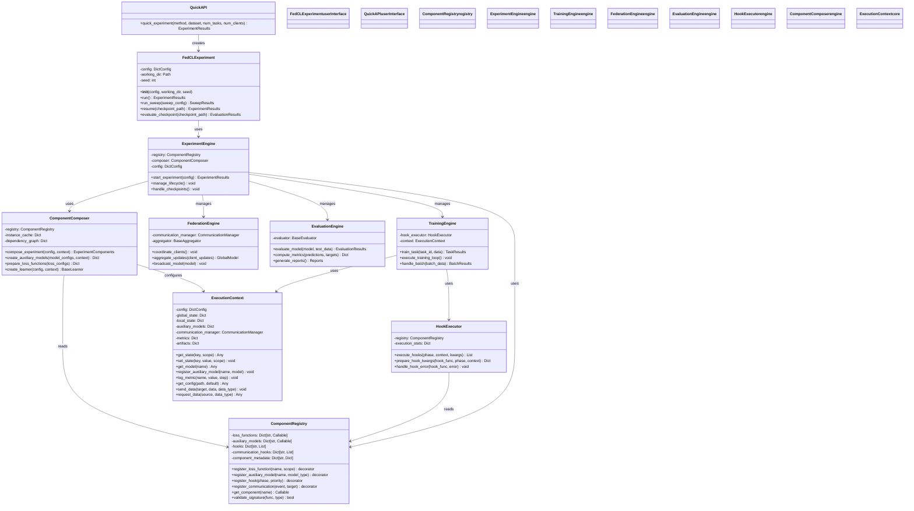

```mermaid
classDiagram
    %% 用户接口层
    class FedCLExperiment {
        -config: DictConfig
        -working_dir: Path
        -seed: int
        +__init__(config, working_dir, seed)
        +run() ExperimentResults
        +run_sweep(sweep_config) SweepResults
        +resume(checkpoint_path) ExperimentResults
        +evaluate_checkpoint(checkpoint_path) EvaluationResults
    }
    
    class QuickAPI {
        +quick_experiment(method, dataset, num_tasks, num_clients) ExperimentResults
    }
    
    %% 注册中心层
    class ComponentRegistry {
        -loss_functions: Dict[str, Callable]
        -auxiliary_models: Dict[str, Callable]  
        -hooks: Dict[str, List]
        -communication_hooks: Dict[str, List]
        -component_metadata: Dict[str, Dict]
        +register_loss_function(name, scope) decorator
        +register_auxiliary_model(name, model_type) decorator
        +register_hook(phase, priority) decorator
        +register_communication(event, target) decorator
        +get_component(name) Callable
        +validate_signature(func, type) bool
    }
    
    %% 执行引擎层
    class ExperimentEngine {
        -registry: ComponentRegistry
        -composer: ComponentComposer
        -config: DictConfig
        +start_experiment(config) ExperimentResults
        +manage_lifecycle() void
        +handle_checkpoints() void
    }
    
    class TrainingEngine {
        -hook_executor: HookExecutor
        -context: ExecutionContext
        +train_task(task_id, data) TaskResults
        +execute_training_loop() void
        +handle_batch(batch_data) BatchResults
    }
    
    class FederationEngine {
        -communication_manager: CommunicationManager
        -aggregator: BaseAggregator
        +coordinate_clients() void
        +aggregate_updates(client_updates) GlobalModel
        +broadcast_model(model) void
    }
    
    class EvaluationEngine {
        -evaluator: BaseEvaluator
        +evaluate_model(model, test_data) EvaluationResults
        +compute_metrics(predictions, targets) Dict
        +generate_reports() Reports
    }
    
    class HookExecutor {
        -registry: ComponentRegistry
        -execution_stats: Dict
        +execute_hooks(phase, context, kwargs) List
        +prepare_hook_kwargs(hook_func, phase, context) Dict
        +handle_hook_error(hook_func, error) void
    }
    
    class ComponentComposer {
        -registry: ComponentRegistry
        -instance_cache: Dict
        -dependency_graph: Dict
        +compose_experiment(config, context) ExperimentComponents
        +create_auxiliary_models(model_configs, context) Dict
        +prepare_loss_functions(loss_configs) Dict
        +create_learner(config, context) BaseLearner
    }
    
    class ExecutionContext {
        -config: DictConfig
        -global_state: Dict
        -local_state: Dict
        -auxiliary_models: Dict
        -communication_manager: CommunicationManager
        -metrics: Dict
        -artifacts: Dict
        +get_state(key, scope) Any
        +set_state(key, value, scope) void
        +get_model(name) Any
        +register_auxiliary_model(name, model) void
        +log_metric(name, value, step) void
        +get_config(path, default) Any
        +send_data(target, data, data_type) void
        +request_data(source, data_type) Any
    }
    
    %% 关系定义
    FedCLExperiment --> ExperimentEngine : uses
    QuickAPI --> FedCLExperiment : creates
    
    ExperimentEngine --> ComponentRegistry : uses
    ExperimentEngine --> ComponentComposer : uses
    ExperimentEngine --> TrainingEngine : manages
    ExperimentEngine --> FederationEngine : manages
    ExperimentEngine --> EvaluationEngine : manages
    
    TrainingEngine --> HookExecutor : uses
    TrainingEngine --> ExecutionContext : uses
    
    HookExecutor --> ComponentRegistry : reads
    ComponentComposer --> ComponentRegistry : reads
    ComponentComposer --> ExecutionContext : configures
    
    %% 样式
    classDef userInterface fill:#e3f2fd,stroke:#1976d2,stroke-width:2px
    classDef registry fill:#f3e5f5,stroke:#7b1fa2,stroke-width:2px
    classDef engine fill:#e8f5e8,stroke:#388e3c,stroke-width:2px
    classDef core fill:#fff3e0,stroke:#f57c00,stroke-width:2px
    
    class FedCLExperiment userInterface
    class QuickAPI userInterface
    class ComponentRegistry registry
    class ExperimentEngine engine
    class TrainingEngine engine
    class FederationEngine engine
    class EvaluationEngine engine
    class HookExecutor engine
    class ComponentComposer engine
    class ExecutionContext core
```