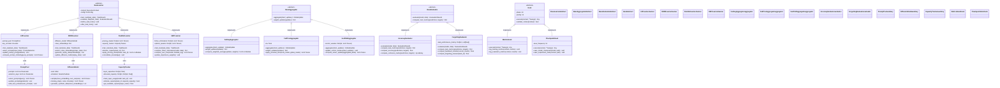

```mermaid
classDiagram
    %% 核心抽象
    class BaseLearner {
        <<abstract>>
        -context: ExecutionContext
        -config: DictConfig
        +train_task(task_data) TaskResults*
        +evaluate_task(task_data) EvaluationResults*
        +before_task_hook() void
        +after_task_hook() void
    }
    
    class BaseAggregator {
        <<abstract>>
        +aggregate(client_updates) GlobalUpdate*
        +weight_updates(updates) Dict*
    }
    
    class BaseEvaluator {
        <<abstract>>
        +evaluate(model, data) EvaluationResults*
        +compute_task_metrics(predictions, targets) Dict*
    }
    
    %% 学习器实现
    class L2PLearner {
        -prompt_pool: PromptPool
        -key_encoder: Encoder
        +train_task(task_data) TaskResults
        +select_prompts(input_data) PromptSelection
        +update_prompt_pool(gradients) void
        +compute_prompt_similarity(query, prompts) torch.Tensor
    }
    
    class DDDRLearner {
        -diffusion_model: DiffusionModel
        -class_embeddings: Dict
        +train_task(task_data) TaskResults
        +extract_class_embeddings(class_data) Dict
        +generate_replay_data(embeddings) List
        +update_diffusion_model(replay_data) void
    }
    
    class PackNetLearner {
        -pruning_masks: Dict[str, torch.Tensor]
        -capacity_tracker: CapacityTracker
        +train_task(task_data) TaskResults
        +allocate_capacity(task_id) Dict
        +apply_pruning_mask(model, task_id) torch.nn.Module
        +consolidate_knowledge() void
    }
    
    class EWCLearner {
        -fisher_information: Dict[str, torch.Tensor]
        -optimal_params: Dict[str, torch.Tensor]
        +train_task(task_data) TaskResults
        +compute_fisher_information(model, data) Dict
        +compute_ewc_loss(model, lambda_reg) torch.Tensor
        +update_importance_weights() void
    }
    
    %% 聚合器实现
    class FedAvgAggregator {
        +aggregate(client_updates) GlobalUpdate
        +weight_updates(updates) Dict
        +compute_weighted_average(updates, weights) torch.nn.Module
    }
    
    class FedProxAggregator {
        -mu: float
        +aggregate(client_updates) GlobalUpdate
        +weight_updates(updates) Dict
        +apply_proximal_term(local_model, global_model) torch.Tensor
    }
    
    class ScaffoldAggregator {
        -control_variates: Dict[str, torch.Tensor]
        +aggregate(client_updates) GlobalUpdate
        +update_control_variates(client_updates) void
        +compute_server_update(aggregated_delta) torch.Tensor
    }
    
    %% 评估器实现
    class AccuracyEvaluator {
        +evaluate(model, data) EvaluationResults
        +compute_task_metrics(predictions, targets) Dict
        +compute_accuracy(predictions, targets) float
        +compute_confusion_matrix(predictions, targets) np.ndarray
    }
    
    class ForgettingEvaluator {
        -task_performance_history: Dict[int, List[float]]
        +evaluate(model, data) EvaluationResults
        +compute_task_metrics(predictions, targets) Dict
        +compute_backward_transfer(current_results) float
        +compute_forgetting_measure(task_id) float
    }
    
    %% 辅助组件
    class PromptPool {
        -prompts: torch.nn.Parameter
        -selection_keys: torch.nn.Parameter
        +select_prompts(query) torch.Tensor
        +update_prompts(gradients) void
        +add_new_prompts(num_prompts) void
    }
    
    class DiffusionModel {
        -unet: UNet
        -scheduler: NoiseScheduler
        +sample(class_embedding, num_samples) torch.Tensor
        +training_step(x, noise, timestep) torch.Tensor
        +generate_synthetic_data(class_embeddings) List
    }
    
    class CapacityTracker {
        -layer_capacities: Dict[str, float]
        -allocated_capacity: Dict[int, Dict[str, float]]
        +track_layer_usage(model, task_id) void
        +allocate_capacity(task_id, required_capacity) bool
        +get_available_capacity(layer_name) float
    }
    
    %% Hook系统
    class Hook {
        <<abstract>>
        -phase: str
        -priority: int
        +execute(context, **kwargs) Any*
        +validate_context(context) bool*
    }
    
    class MetricsHook {
        +execute(context, **kwargs) Any
        +log_training_metrics(context, metrics) void
        +log_evaluation_metrics(context, results) void
    }
    
    class CheckpointHook {
        -save_frequency: int
        +execute(context, **kwargs) Any
        +save_model_checkpoint(model, path) void
        +save_experiment_state(context, path) void
    }
    
    %% 关系定义
    BaseLearner <|-- L2PLearner : implements
    BaseLearner <|-- DDDRLearner : implements
    BaseLearner <|-- PackNetLearner : implements
    BaseLearner <|-- EWCLearner : implements
    
    BaseAggregator <|-- FedAvgAggregator : implements
    BaseAggregator <|-- FedProxAggregator : implements
    BaseAggregator <|-- ScaffoldAggregator : implements
    
    BaseEvaluator <|-- AccuracyEvaluator : implements
    BaseEvaluator <|-- ForgettingEvaluator : implements
    
    Hook <|-- MetricsHook : implements
    Hook <|-- CheckpointHook : implements
    
    L2PLearner --> PromptPool : uses
    DDDRLearner --> DiffusionModel : uses
    PackNetLearner --> CapacityTracker : uses
    
    %% 样式
    classDef abstract fill:#f5f5f5,stroke:#666,stroke-width:2px,stroke-dasharray: 5 5
    classDef learner fill:#e8f5e8,stroke:#388e3c,stroke-width:2px
    classDef aggregator fill:#e3f2fd,stroke:#1976d2,stroke-width:2px
    classDef evaluator fill:#fff3e0,stroke:#f57c00,stroke-width:2px
    classDef auxiliary fill:#fce4ec,stroke:#c2185b,stroke-width:2px
    classDef hook fill:#f3e5f5,stroke:#7b1fa2,stroke-width:2px
    
    class BaseLearner abstract
    class BaseAggregator abstract
    class BaseEvaluator abstract
    class Hook abstract
    class L2PLearner learner
    class DDDRLearner learner
    class PackNetLearner learner
    class EWCLearner learner
    class FedAvgAggregator aggregator
    class FedProxAggregator aggregator
    class ScaffoldAggregator aggregator
    class AccuracyEvaluator evaluator
    class ForgettingEvaluator evaluator
    class PromptPool auxiliary
    class DiffusionModel auxiliary
    class CapacityTracker auxiliary
    class MetricsHook hook
    class CheckpointHook hook
```