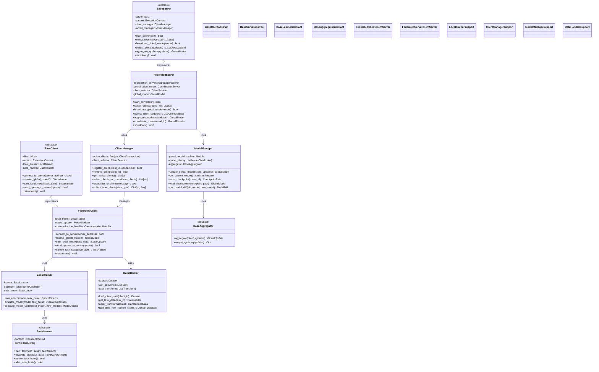

```mermaid
classDiagram
    %% 客户端服务端抽象层
    class BaseClient {
        <<abstract>>
        -client_id: str
        -context: ExecutionContext
        -local_trainer: LocalTrainer
        -data_handler: DataHandler
        +connect_to_server(server_address) bool
        +receive_global_model() GlobalModel*
        +train_local_model(task_data) LocalUpdate*
        +send_update_to_server(update) bool*
        +disconnect() void*
    }
    
    class BaseServer {
        <<abstract>>
        -server_id: str
        -context: ExecutionContext
        -client_manager: ClientManager
        -model_manager: ModelManager
        +start_server(port) bool
        +select_clients(round_id) List[str]*
        +broadcast_global_model(model) bool*
        +collect_client_updates() List[ClientUpdate]*
        +aggregate_updates(updates) GlobalModel*
        +shutdown() void*
    }
    
    %% 客户端服务端实现
    class FederatedClient {
        -local_trainer: LocalTrainer
        -model_updater: ModelUpdater
        -communication_handler: CommunicationHandler
        +connect_to_server(server_address) bool
        +receive_global_model() GlobalModel
        +train_local_model(task_data) LocalUpdate
        +send_update_to_server(update) bool
        +handle_task_sequence(tasks) TaskResults
        +disconnect() void
    }
    
    class FederatedServer {
        -aggregation_server: AggregationServer
        -coordination_server: CoordinationServer
        -client_selector: ClientSelector
        -global_model: GlobalModel
        +start_server(port) bool
        +select_clients(round_id) List[str]
        +broadcast_global_model(model) bool
        +collect_client_updates() List[ClientUpdate]
        +aggregate_updates(updates) GlobalModel
        +coordinate_round(round_id) RoundResults
        +shutdown() void
    }
    
    %% 训练和管理组件
    class LocalTrainer {
        -learner: BaseLearner
        -optimizer: torch.optim.Optimizer
        -data_loader: DataLoader
        +train_epoch(model, task_data) EpochResults
        +evaluate_model(model, test_data) EvaluationResults
        +compute_model_update(old_model, new_model) ModelUpdate
    }
    
    class ClientManager {
        -active_clients: Dict[str, ClientConnection]
        -client_selector: ClientSelector
        +register_client(client_id, connection) bool
        +remove_client(client_id) bool
        +get_active_clients() List[str]
        +select_clients_for_round(num_clients) List[str]
        +broadcast_to_clients(message) bool
        +collect_from_clients(data_type) Dict[str, Any]
    }
    
    class ModelManager {
        -global_model: torch.nn.Module
        -model_history: List[ModelCheckpoint]
        -aggregator: BaseAggregator
        +update_global_model(client_updates) GlobalModel
        +get_current_model() torch.nn.Module
        +save_checkpoint(round_id) CheckpointPath
        +load_checkpoint(checkpoint_path) GlobalModel
        +get_model_diff(old_model, new_model) ModelDiff
    }
    
    class DataHandler {
        -dataset: Dataset
        -task_sequence: List[Task]
        -data_transforms: List[Transform]
        +load_client_data(client_id) Dataset
        +get_task_data(task_id) DataLoader
        +apply_transforms(data) TransformedData
        +split_data_non_iid(num_clients) Dict[str, Dataset]
    }
    
    %% 抽象接口
    class BaseLearner {
        <<abstract>>
        -context: ExecutionContext
        -config: DictConfig
        +train_task(task_data) TaskResults*
        +evaluate_task(task_data) EvaluationResults*
        +before_task_hook() void
        +after_task_hook() void
    }
    
    class BaseAggregator {
        <<abstract>>
        +aggregate(client_updates) GlobalUpdate*
        +weight_updates(updates) Dict*
    }
    
    %% 关系定义
    BaseClient <|-- FederatedClient : implements
    BaseServer <|-- FederatedServer : implements
    
    FederatedClient --> LocalTrainer : uses
    FederatedClient --> DataHandler : uses
    
    FederatedServer --> ClientManager : uses
    FederatedServer --> ModelManager : uses
    
    ClientManager --> FederatedClient : manages
    ModelManager --> BaseAggregator : uses
    LocalTrainer --> BaseLearner : uses
    
    %% 样式
    classDef abstract fill:#f5f5f5,stroke:#666,stroke-width:2px,stroke-dasharray: 5 5
    classDef clientServer fill:#fff8e1,stroke:#ff8f00,stroke-width:3px
    classDef support fill:#e8f5e8,stroke:#388e3c,stroke-width:2px
    
    class BaseClient abstract
    class BaseServer abstract
    class BaseLearner abstract
    class BaseAggregator abstract
    class FederatedClient clientServer
    class FederatedServer clientServer
    class LocalTrainer support
    class ClientManager support
    class ModelManager support
    class DataHandler support
```