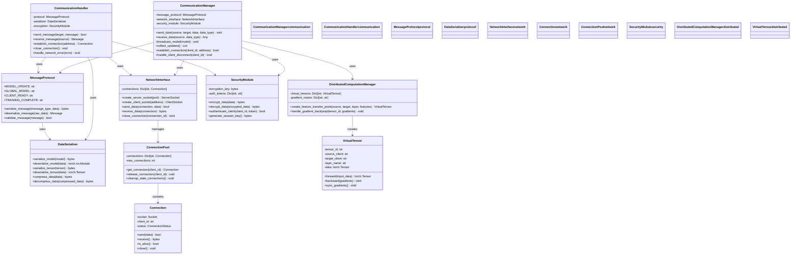

```mermaid
classDiagram
    %% 通信管理核心
    class CommunicationManager {
        -message_protocol: MessageProtocol
        -network_interface: NetworkInterface
        -security_module: SecurityModule
        +send_data(source, target, data, data_type) void
        +receive_data(source, data_type) Any
        +broadcast_model(model) void
        +collect_updates() List
        +establish_connection(client_id, address) bool
        +handle_client_disconnect(client_id) void
    }
    
    class CommunicationHandler {
        -protocol: MessageProtocol
        -serializer: DataSerializer
        -encryption: SecurityModule
        +send_message(target, message) bool
        +receive_message(source) Message
        +establish_connection(address) Connection
        +close_connection() void
        +handle_network_error(error) void
    }
    
    %% 消息协议层
    class MessageProtocol {
        +MODEL_UPDATE: str
        +GLOBAL_MODEL: str
        +CLIENT_READY: str
        +TRAINING_COMPLETE: str
        +serialize_message(message_type, data) bytes
        +deserialize_message(raw_data) Message
        +validate_message(message) bool
    }
    
    %% 网络接口层
    class NetworkInterface {
        -connections: Dict[str, Connection]
        +create_server_socket(port) ServerSocket
        +create_client_socket(address) ClientSocket
        +send_data(connection, data) bool
        +receive_data(connection) bytes
        +close_connection(connection_id) void
    }
    
    %% 分布式计算管理
    class DistributedComputationManager {
        -virtual_tensors: Dict[str, VirtualTensor]
        -gradient_routes: Dict[str, str]
        +create_feature_transfer_point(source, target, layer, features) VirtualTensor
        +handle_gradient_backprop(tensor_id, gradients) void
    }
    
    %% 安全模块
    class SecurityModule {
        -encryption_key: bytes
        -auth_tokens: Dict[str, str]
        +encrypt_data(data) bytes
        +decrypt_data(encrypted_data) bytes
        +authenticate_client(client_id, token) bool
        +generate_session_key() bytes
    }
    
    %% 数据序列化
    class DataSerializer {
        +serialize_model(model) bytes
        +deserialize_model(data) torch.nn.Module
        +serialize_tensor(tensor) bytes
        +deserialize_tensor(data) torch.Tensor
        +compress_data(data) bytes
        +decompress_data(compressed_data) bytes
    }
    
    %% 连接管理
    class Connection {
        -socket: Socket
        -client_id: str
        -status: ConnectionStatus
        +send(data) bool
        +receive() bytes
        +is_alive() bool
        +close() void
    }
    
    class ConnectionPool {
        -connections: Dict[str, Connection]
        -max_connections: int
        +get_connection(client_id) Connection
        +release_connection(client_id) void
        +cleanup_stale_connections() void
    }
    
    %% 虚拟张量（用于分布式计算）
    class VirtualTensor {
        -tensor_id: str
        -source_client: str
        -target_client: str
        -layer_name: str
        -data: torch.Tensor
        +forward(input_data) torch.Tensor
        +backward(gradients) void
        +sync_gradients() void
    }
    
    %% 关系定义
    CommunicationManager --> MessageProtocol : uses
    CommunicationManager --> NetworkInterface : uses
    CommunicationManager --> SecurityModule : uses
    CommunicationManager --> DistributedComputationManager : uses
    
    CommunicationHandler --> MessageProtocol : uses
    CommunicationHandler --> NetworkInterface : uses
    CommunicationHandler --> DataSerializer : uses
    CommunicationHandler --> SecurityModule : uses
    
    NetworkInterface --> ConnectionPool : manages
    ConnectionPool --> Connection : contains
    
    DistributedComputationManager --> VirtualTensor : creates
    
    MessageProtocol --> DataSerializer : uses
    
    %% 样式
    classDef communication fill:#e0f2f1,stroke:#00695c,stroke-width:2px
    classDef protocol fill:#e3f2fd,stroke:#1976d2,stroke-width:2px
    classDef network fill:#fff3e0,stroke:#f57c00,stroke-width:2px
    classDef security fill:#fce4ec,stroke:#c2185b,stroke-width:2px
    classDef distributed fill:#f3e5f5,stroke:#7b1fa2,stroke-width:2px
    
    class CommunicationManager communication
    class CommunicationHandler communication
    class MessageProtocol protocol
    class DataSerializer protocol
    class NetworkInterface network
    class Connection network
    class ConnectionPool network
    class SecurityModule security
    class DistributedComputationManager distributed
    class VirtualTensor distributed
```